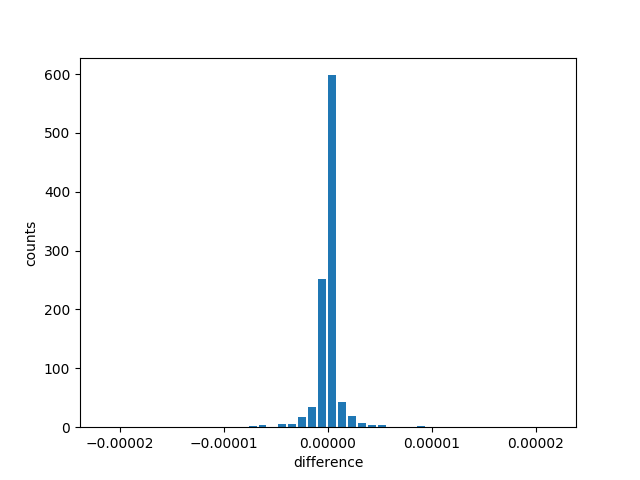

Sampling example (Phase estimation)
===================================

In this page, an example of sampling with phase estimation is demonstrated.

Qgate implements sampling.  By using samples, we can get multple measurement results from pre-calculated probability vector.

When a qubit is measured, its quantum state decoheres, and this qubit has a bit value, 0 or 1.  Measurement is a irreversible process, losing quantum coherence.  For the next measurement, quantum circuits should be executed.

In quantum circuit simulator, quantum states are numerically held in state vectors, and probabilities are explicitly calculated.  By using this pre-calculated probability vector, we are able to make samplings to carry out multiple measurements without executing quantum circuits multiple times.

However, there're some limitations relating to measuremnt operations when utilizing sampling.  In Qgate 0.2.x, sampling implementation has limitations shown below:

(1) Quantum circuits is not allowed to have measurement,

    | Measurement oprations destory quantum coherence, so should not be included. 

(2) Quantum circuits is not allowed to have if-clause.

    | if-clause uses measurement results to branch execution of quantum circuits.

Above are current limitations, and might be resolved in future versions.

Code walkthrough
----------------

The original source is `here <https://github.com/shinmorino/qgate/blob/master/examples/phase_estimation.py>`_ (`raw <https://raw.githubusercontent.com/shinmorino/qgate/master/examples/phase_estimation.py>`_)

Generating QFT and iQFT circuits
^^^^^^^^^^^^^^^^^^^^^^^^^^^^^^^^

The functions shown below generates QFT circuit.

.. code-block:: python
   :linenos:
      
   # importing qgate packages
   import qgate
   from qgate.script import *
   import math

   def qft_internal_layer(qregs) :
      ops = list()
      target = qregs[0]
      ops.append(H(target))
      for idx, ctrlbit in enumerate(qregs[1:]):
          theta = math.pi / float(1 << (idx + 1))
	  r = ctrl(ctrlbit).U1(theta)(target)
          ops.append(r)
    return ops

    # float value: 0.j1j2j3...jn
    # qubits |j0j1j2 ... jn-1> -> qreg list [q0, q1, q2, ... , q_n-1)]
    def qft(qregs) :
        ops = list()
	n_qregs = len(qregs)
	for idx in range(n_qregs):
	    ops += qft_internal_layer(qregs[idx:])
	return ops

iqft() is defined as adjoint of qft.

.. code-block:: python
   :lineno-start: 24

    # float value: 0.j1j2j3...jn
    # qubits |j0j1j2 ... jn-1> -> qreg list [q0, q1, q2, ... , q_n-1)]
    def iqft(qregs) :
        ops = qft(qregs)
        ops.reverse()
        for op in ops:
            op.set_adjoint(True)
        return ops

main
^^^^

In this example, phase of a single qubit is measured.  Phase is modified by using global phase operator, Expii(theta).

.. code-block:: python
   :lineno-start: 43

   # value to be measured.
   v_in = 0.1

   # target qreg whose phase is measured.
   target = new_qreg()

   # number of qregs for estimated phase value.
   n_bits = 20
   # qregs for iqft.
   bits = new_qregs(n_bits)

The first stage of phase estimation.  H gate is applied to all qregs, and global phase gate, Expii(theta) is applied with controlled bits to set phase as defined in phase estimation algorithm.

.. code-block:: python
   :lineno-start: 54

   # initialize
   ops = [H(qreg) for qreg in bits]

   # set phase in the target qreg.
   # Ui = Expii(pi * theta * 2^i), U1, U2, U4, U8 ...
   for idx, ctrlreg in enumerate(bits):
      theta = 2 * math.pi * v_in * (1 << idx)
      ops.append(ctrl(ctrlreg).Expii(theta)(target))

iQFT gate sequence is added to circuit.  By using qgate.dump(), operators in circuit is dumped to console.
      
.. code-block:: python
   :lineno-start: 63

   # iqft gate sequence
   ops += iqft(bits)
   
   # dump circuit
   qgate.dump(ops)

CPU version of simulator instance is created, and prepared circuit executed.  You can dump probability vector by using qgate.dump(sim.qubits.prob).  Qubits.set_ordering() is used to specify order of qubits in console output. 
		  
.. code-block:: python
   :lineno-start: 68

   # run simulator
   sim = qgate.simulator.cpu()
   sim.run(ops)

   # following lines is to dump probability vector.
   # sim.qubits.set_ordering(reversed(bits))
   # qgate.dump(sim.qubits.prob)

A samping pool instance is created by calling Qubits.create_sampling_pool().  Qregs of interest are those used for iQFT.  So iQFT qreg list, bits, is passed as the parameter.

SamplingPool.sample() accepts samping number as its parameter, 1024.  This method returns ObservationList.  A histgram of measured results is created from ObservationList by using histgram() method.

.. code-block:: python
   :lineno-start: 77

   # creating sampling pool
   pool = sim.qubits.create_sampling_pool(bits)
   # sample 1024 times.
   obs = pool.sample(1024)
   # creating histgram
   hist = obs.histgram()
   #print(hist)

Results are represented as bit-strings.  The function to_real() is used to convert a bit string to a corresponding floating value.
		  
.. code-block:: python
   :lineno-start: 34

    def to_real(bits, n_bits):
      value = 0.
      for idx in range(n_bits):
          mask = 1 << idx
          if bits & mask != 0:
              value += math.pow(0.5, idx + 1)
    return value

Observed bit strings are converted to floating numbers and sorted.  In the end of this part, frequency distribution is output to console.
    
.. code-block:: python
   :lineno-start: 83

    # converting sampled values to floating values.
    results = list()
    for bits, count in hist.items():
        v = to_real(bits, n_bits)
        results.append((v, count))
    results.sort(key = lambda r:r[0])

    # output frequency distribution. 
    for r in results:
        print(r)

Below is an example of frequency distribution output.  We see sampled counts are large around 0.1 which is the expected result.
	
.. code-block:: console

    (0.09986305236816406, 1)
    (0.09994316101074219, 2)
      (snip)
    (0.0999908447265625, 2)
    (0.0999917984008789, 1)
    (0.09999275207519531, 1)
    (0.09999370574951172, 5)
    (0.09999465942382812, 5)
    (0.09999561309814453, 3)
    (0.09999656677246094, 8)
    (0.09999752044677734, 13)
    (0.09999847412109375, 45)
    (0.09999942779541016, 265)
    (0.10000038146972656, 575)
    (0.10000133514404297, 47)
    (0.10000228881835938, 8)
    (0.10000324249267578, 7)
    (0.10000419616699219, 3)
    (0.1000051498413086, 1)
    (0.100006103515625, 3)
    (0.1000070571899414, 2)
    (0.10000801086425781, 4)
    (0.10000896453857422, 2)
      (snip)
    (0.10009956359863281, 1)
    (0.10029220581054688, 1)

Below is to plot observed results by using matplotlib.

.. code-block:: python
   :lineno-start: 92

    import matplotlib.pyplot as plt
    
    diff = [r[0] - v_in for r in results]
    height = [r[1] for r in results]
    plt.bar(diff, height, width = 0.8 * math.pow(0.5, n_bits))
    x_delta = 25 * math.pow(0.5, n_bits)
    plt.xlim(- x_delta, x_delta)
    plt.xlabel('difference')
    plt.ylabel('counts')
    plt.show()

Results are plotted as histgram as shown below.
Since the input value of 0.1 is not precisely represented in bit string, 2 tall bars are observed and are located at 0.09999942779541016 and 0.10000038146972656, the 2 closest values to 0.1.
    

